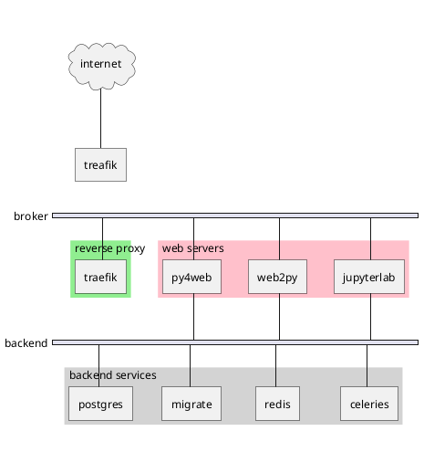

# Architectuur vanuit netwerk perspectief

 * **Host**: fysieke machine (laptop, desktop)
 * **Virtual Machine**: virtuele host, meestal via multipass of in de cloud
 * **Server**: een fysieke of virtuele machine die programma's draait (services)
 * **Service**: een programma dat meestal reageert op netwerk verbinding en antwoord geeft, 
   zoals webpagina's, fragmenten, api's enz. 
 * **CloudVPS**: cloudbased virtual machine hoster
 * **Multipass**: Canonical product waarmee op je eigen host snel een virtuele ubuntu te draaien is
 * **Docker**: software container (geen virtualisatie!)
 * **Reverse proxy**: programma wat connecties vanaf het internet opvangt en doorstuurt naar 
   programmas (in een docker bijvoorbeeld) 
 * **CDN**: Content Delivery Network, het hosten van static files, zodat je eigen webserver het daar 
   niet zo druk mee heeft en mensen sneller bediend worden, en daarom een snellere ervaringen 
   hebben. 
 * **B2**: Backblaze B2, gebruiken wij voor online fileopslag en als CDN


Bezoekers komen vanaf internet om pagina's op onze etalages te bekijken. 
Onze web-etalages (cmsx, ghost) tonen html, css, javascript, plaatjes, fonts via https. 
Traefik is de reverse proxy die dit https (beveiligd) verkeer ontvangt, "opschoont", en vervolgens 
uitzoekt 
waar 
het naar toe moet. Dit gebeurd op basis van configuratie in de docker-compose. 
Traefik stuurt het http (onbeveiligd) verzoek naar de server welke een antwoord moet verzinnen. 
Dit antwoord stuurt de service terug naar Traefik, die het vervolgens over de beveiligde lijn 
teruggeeft aan de aanvrager op het internet. 

```plantuml
participant browser
participant traefik
activate browser
browser -> traefik: https GET request
activate traefik
traefik -> cmsx: http GET request
activate cmsx
note right
  CMSx geeft o.a. opdrachten via HTMX om 
  fragmenten van de fragmentx server te halen. 
end note 
cmsx -> traefik: http response 
deactivate cmsx
traefik -> browser: https response
deactivate traefik

loop 
    rnote over browser
      browser voert javascript uit en 
      vraagt fragment op 
    end note 
    
    browser -> traefik ++: xhr https GET/POST
    traefik -> fragmentx ++: http GET/POST
    rnote over pgpool 
      de fragmentx levert bijvoorbeeld de tegels, 
      maar ook het login scherm, wachtwoord validatie
      en zoekopdrachten tags. Dit gebruikt de database
      voor gegevens, cache enz. 
    end note 
    fragmentx -> pgpool ++: SQL queries
    pgpool -> pg0 ++: SQL Query
    pgpool -> pg1 ++: SQL Query
    pg1 -> pgpool --: data
    deactivate pg0
    pgpool -> fragmentx --: data 
    rnote over pgpool 
      Eventuele verwerking aan achtergrond processen 
      wordt afgegeven. 
    end note 
    fragmentx -> redis ++: verzoek tot latere verwerking
    redis --> fragmentx 
    fragmentx -> traefik --: http response
    redis -[#green]> celeryworker ++  
    traefik -> browser --: https response
end 
deactivate browser 
rnote over celeryworker
  de verlaatte verwerking vind plaats.
end note
celeryworker -[#green]>]: verstuur email
celeryworker -[#green]> pgpool: SQL statement
deactivate browser
```

Om het verkeer te scheiden ziet de docker netwerken er zo uit:



