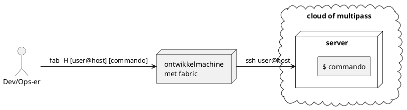

# Wat is fabric

Fabric is een python library die het mogelijk maakt om commando's uit te voeren op een remote
server. Het is een alternatief voor Ansible, maar dan met een veel eenvoudiger syntax.
Fabric gebruikt een `fabfile.py` om commando's uit te voeren. De commando's zijn geschreven in
python. Fabric commando's werken alleen in de directory waar de `fabfile.py` aanwezig is.

## Hoe werkt fabric?
Je start fabric met een commando, bijvoorbeeld `fab -H [host] [commando]`. Fabric zal dan
de `fabfile.py` in de huidige directory doorzoeken naar een functie met de naam van het commando.
Als deze functie gevonden is, zal deze uitgevoerd worden. De functie moet gedecoreerd zijn met
`@task` om als commando herkend te worden. De functie kan een argumenten hebben, die je meegeeft
als `fab -H [host] [commando]:[argument]`. De functie kan ook een argumenten hebben die je
niet meegeeft, maar die je wel kunt meegeven. Deze argumenten worden dan gevraagd als je het
commando uitvoert.



## Hoe installeer je fabric?
Fabric gebruik je vanuit een developer machine. Fabric moet daarom door de beheerder of 
ontwikkelaar [zelf geinstalleerd](hoe-installeer-je-omgevingen.md) worden. Normaal gesproken doe 
je dat via pipx, zodat de virtuele omgeving voor fabric niet in de weg zit van andere python 
projecten.

Onze fabfile leeft in de [server_provisioning repository](https://github.
com/educationwarehouse/server_provisioning). Via [een git clone](wat-is-git.md) krijg je de fabfile 
lokaal beschikbaar en kun je deze gebruiken.  

## Waarvoor gebruik je fabric?
Fabric gebruiken we vooral voor het inrichten van servers, en een paar andere handige functies die 
met een lokale of remote server te maken hebben. De beschikbare commando's vraag je op met 
`--list` (met uitleg) of `--complete` (zonder uitleg). 

De docstrings die je ziet bij `--list` zijn de docstrings die in de fabfile staan. 


```shell
remco@vortex ~/P/provision_server master @ fab --list
Available tasks:

  add-apt-repository
  add-user-to-group
  append-key-to-remote                              command-line-key is/zijn de key(s) die je toevoegd aan de remote machine.
  apt-install
  apt-upgrade
  assert-passwords-disabled-on-ssh
  assert-root-disabled-on-ssh
  clone-git-repo-with-new-key-file-for-edwh-repos
  connect-postgres
  create-virtualenv
  delete-key-from-remote                            command-line-key is/zijn de key(s) die je toevoegd aan de remote machine.
  do                                                Voert remote commandos of invoke statements uit, binnen de opgegeven omgeving(en).
  enable-firewall                                   open ports with ufw, and docker-ufw.
  generate-key                                      message: Geef een verduidelijke bericht mee aan de key die gegenareerd wordt.
  get-open-ports
  install-antivirus
  install-docker
  install-joplin
  install-omgeving                                  Clone een git repository naar de directory `omgeving` in de homefolder, en voer `invoke setup` daar uit.
  install-python
  install-xonsh
  list-keys                                         Je krijgt een overzicht te zien van alle keys
  list-local-keys                                   Hier komt de lijst te staan van alle sleutels die dus LOCAL in de yaml file staan.
  list-remote-keys                                  Hier komt de lijst te staan van alle sleutels die dus op de REMOTE machine staan.
  new-ghost                                         Creates a new ghost instance docker-compose fragment.
  prepare-apt
  prepare-generic-server                            Updates apt and dist-upgrades the machine. Installs python, docker, docker-compose, and xonsh.
  prepare-git-client
  prepare-joplin-server
  prepare-ontwikkelstraat-server
  set-noninteractive
  set-root-password                                 Sets remote root password to given password, or asks the user for one.
  show-user-groups
```


