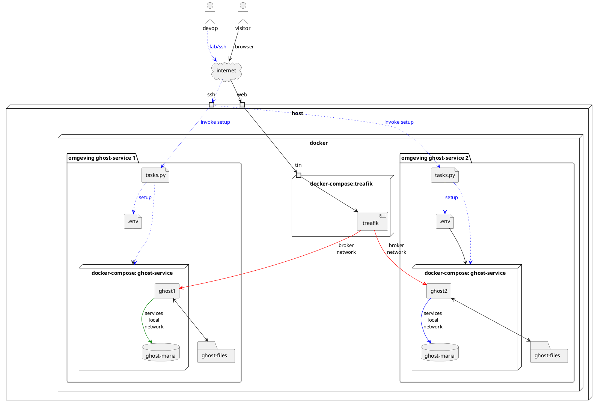

# Wat is Ghost

Zie ook https://taiga.edwh.nl/project/remco-ewcore/us/570 

```plantuml
@startuml
actor devop 
actor visitor
cloud internet 
devop --> internet #blue;line.dotted;text:blue : fab/ssh
visitor --> internet : browser
node host {
  portin web 
  portin ssh
  node docker{
    node "docker-compose:treafik" as traefikservice {
      portin tin
      [treafik] as treafik
    }
    folder "omgeving ghost-service 1" as service1{
      file "tasks.py" as tasks1
      file ".env" as dotenv1 
      tasks1 --> dotenv1 #blue;line.dotted;text:blue : setup
      folder "ghost-files" as ghostfiles1 
      node "docker-compose: ghost-service" as ghostservice1 {
        agent ghost1
        database "ghost-maria" as ghostdb1 
        ghost1 <--> ghostfiles1  
      }
      tasks1 --> ghostservice1 #blue;line.dotted;text:blue 
      dotenv1 --> ghostservice1 
    }
    folder "omgeving ghost-service 2" as service2{
      file "tasks.py" as tasks2
      file ".env" as dotenv2
      tasks2 --> dotenv2 #blue;line.dotted;text:blue : setup
      folder "ghost-files" as ghostfiles2
      node "docker-compose: ghost-service" as ghostservice2 {
        agent ghost2
        database "ghost-maria" as ghostdb2
        ghost2 <--> ghostfiles2 
      }
      tasks2 --> ghostservice2 #blue;line.dotted;text:blue 
      dotenv2 --> ghostservice2     
    }
  }
}
internet --> web 
internet --> ssh #blue;line.dotted;text:blue 
ssh --> tasks1 #blue;line.dotted;text:blue : invoke setup
ssh --> tasks2 #blue;line.dotted;text:blue : invoke setup
web --> tin
tin --> treafik
treafik --> ghost1 #line:red : broker\nnetwork
treafik --> ghost2 #line:red : broker\nnetwork
ghost1 --> ghostdb1 #line:green : services\nlocal\nnetwork
ghost2 --> ghostdb2 #line:blue  : services\nlocal\nnetwork
@enduml

```