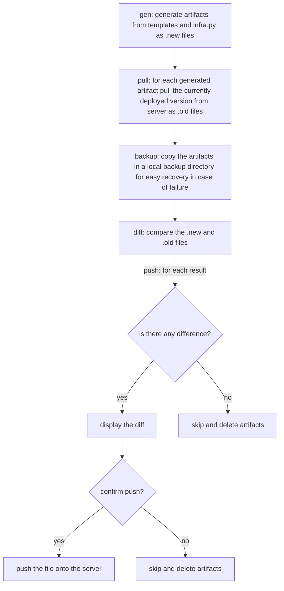
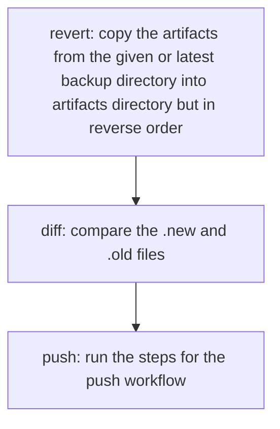

# Infrable

Hanny's legendary infrastructure as code solution.

```bash
pip install -U infrable  # requires python >= 3.10
```

# Table of contents

1. [Infrable](#infrable)
   1. [Preface](#preface)
   2. [Chapter 1 - Chaos](#chapter-1---chaos)
   3. [Chapter 2 - Hosts and services](#chapter-2---hosts-and-services)
   4. [Chapter 3 - Templates](#chapter-3---templates)
   5. [Chapter 4 - The Deploy or Recover Workflow](#chapter-4---the-deploy-or-recover-workflow)
      1. [Deploy workflow](#deploy-workflow)
      2. [Recover workflow](#recover-workflow)

### Preface

In an infinite void surrounded by blinking lights, Hanny woke up with her memory hollow,
only her name echoing in the dark corners of her mind. She found herself floating in a
realm between the tangible world of Python code and the ethereal cosmos of the space. A
synthetic voice resonated around her about a crucial **infrastructure migration project**
but it was all Greek to her. Her memory, once the key to the **Python** kingdom, failed to
provide any answers. She was stuck in an interstellar labyrinth, entrusted with a
technology mission she could not recall, her only anchors being a mechanical keyboard and
lines of code whizzing past on the nearby screen.

### Chapter 1 - Chaos

In the void of her discontent, Hanny started to recall fragments of a past life: back on
Earth, where a looming infrastructure migration project threatened to upend everything.
Humanity grappled with a **chaotic infrastructure** and an ill-prepared toolkit. Python
developers fought with convoluted tools, while the desperate search for **declarative
configuration management** proved futile. Amidst this disarray, Hanny was catapulted into
the cosmos, a reluctant knight tasked with an unenviable quest: to find an
**uncomplicated yet competent solution** capable of taming this looming catastrophe.

### Chapter 2 - Hosts and services

In a moment of revelation, Hanny grasped the intricacies of infrastructure: **hosts and the
services** they housed, the vital backbone of any system. She understood the criticality of
maintaining **a single reference source, a complete, harmonious documentation capturing
these elemental relationships**. Committing herself to uphold this single source of truth
principle, she began the painstaking process of documentation, pouring every detail into
a consolidated testament christened **infra.py**.

**infra.py**

```python
template_prefix = "https://github.com/username/repo/blob/main"

# Hosts/ -----------------------------------------------------------------------
dev_host = Host(fqdn="dev.example.com", ip="127.0.0.1")
beta_host = Host(fqdn="beta.example.com", ip="127.0.0.1")
prod_host = Host(fqdn="prod.example.com", ip="127.0.0.1")
# /Hosts -----------------------------------------------------------------------


# Services/ --------------------------------------------------------------------
dev_web = Service(host=dev_host, port=8080)
beta_web = Service(host=beta_host, port=8080)
prod_web = Service(host=prod_host, port=8080)

dev_nginx = Service(host=dev_host, port=80)
beta_nginx = Service(host=beta_host, port=80)
prod_nginx = Service(host=prod_host, port=80)
# /Services --------------------------------------------------------------------
```

### Chapter 3 - Templates

Gradually piecing together her fragmented memories, Hanny realized configuration files
for the host deployments ought to be maintained as **templates, drawing values as
needed from "infra.py"**. Back on Earth, the challenge had been a lack of a coherent
system to document the path of these files, a problem of organization that posed a
significant hurdle. Then, in a moment of genius, Hanny conceived a groundbreaking
solution. She'd document the files' path directly within the configuration templates
themselves. And so, with renewed vigor, she started adding crucial details as **header
comments nestled within the configuration files**, a legendary stroke promising to
transform the face of infrastructure migration.

**templates/nginx/web.j2**

```nginx
# vim: syn=nginx

# ---
# src: {{ template_prefix }}/{{ _template.src }}
# dest: {{ dev_nginx.host }}:/etc/nginx/sites-enabled/web
# chmod: 644
# chown: root:root
# ---

server {
    listen 80;
    listen [::]:80;

    server_name {{ dev_nginx.host.fqdn }} www.{{ dev_nginx.host.fqdn }};

    location / {
        proxy_pass http://localhost:{{ dev_web.port }};
        include proxy_params;
    }
}
```

### Chapter 4 - The Deploy or Recover Workflow

In the vast expanse of uncertainty, one thing became crystal clear to Hanny: the
importance of reviewing the files made through "infra.py" and **comparing these with the
currently deployed configurations before pushing them**. This process would **intercept
any live changes and ensure their inclusion in the templates**. Her cautious nature also
recognized the essential function of maintaining **local backups** of the utilized
configurations, providing an insurance of sorts. To address any complications, she
conceived a failsafe measure: **The Deploy or Recover Workflow**. It promised relief from
human error while ensuring an approach to **easily revert and recover** the service,
another triumphant stride in Hanny’s cosmic saga.

#### Deploy workflow

```bash
infrable files deploy

## same as
# infrable files gen
# infrable files pull
# infrable files backup
# infrable files push
```



#### Recover workflow

```bash
infrable files recover

## same as
# infrable files revert
# infrable files push
```



### Chapter 5 - Commands and Tasks

TODO: Document commands

```bash
# Run a command on a host by name
infrable remote dev_host "sudo systemctl reload nginx"

# Or by service name
infrable remote dev_nginx "sudo systemctl reload nginx"

# Or all affected hosts (as per files diff)
infrable remote affected-hosts "sudo systemctl reload nginx"

# Or
infrable files affected-hosts | infrable remote - "sudo systemctl reload nginx"
```

TODO: Document tasks

**infra.py**

```python
nginx_dev.typer = typer.Typer()
@nginx_dev.typer.command()
def reload(test: bool = True):
    assert nginx.host, "Service must have a host to reload"
    if test:
        nginx.host.remote().sudo.nginx("-t")
    nginx.host.remote().sudo.systemctl.reload.nginx()
```

```bash
infrable nginx-dev reload --test
```

Or define a global reload task

**infra.py**

```python
reload = typer.Typer()
@reload.command()
def nginx_dev(test: bool = True):
    assert nginx.host, "Service must have a host to reload"
    if test:
        nginx.host.remote().sudo.nginx("-t")
    nginx.host.remote().sudo.systemctl.reload.nginx()
```

```bash
infrable reload nginx-dev --test
```

### Chapter 6 - Environments and switches

TODO: Document environments

**infra.py**

```bash
# Environments/ ----------------------------------------------------------------
dev = "dev"
beta = "beta"
prod = "prod"

environments = {dev, beta, prod}
env = Switch(environments, init=dev)  # <-- defining a switch between different environments
current_env = env()
# /Environments ----------------------------------------------------------------

# Hosts/ -----------------------------------------------------------------------
dev_host = Host(fqdn="dev.example.com", ip="127.0.0.1")
beta_host = Host(fqdn="beta.example.com", ip="127.0.0.1")
prod_host = Host(fqdn="prod.example.com", ip="127.0.0.1")

managed_hosts = env(  # <-- defining hosts for different environments
    dev=[dev_host],
    beta=[beta_host],
    prod=[prod_host],
)
# /Hosts -----------------------------------------------------------------------

# Services/ --------------------------------------------------------------------
web = Service(
    host=env(dev=dev_host, beta=beta_host, prod=prod_host),
    port=8080,
)

nginx = Service(
    port=80,
    host=env(dev=dev_host, beta=beta_host, prod=prod_host),
)
# /Services --------------------------------------------------------------------
```

Update templates to use the environment specific values hosts:

**templates/nginx/proxy_params.j2**

```nginx
# vim: syn=nginx

# ---
# src: {{ template_prefix }}/{{ _template.src }}
# dest:
# 
#   - loc: {{ host }}:/etc/nginx/proxy_params
# 
# chmod: 644
# chown: root:root
# ---
proxy_set_header Host $http_host;
proxy_set_header X-Real-IP $remote_addr;
proxy_set_header X-Forwarded-For $proxy_add_x_forwarded_for;
proxy_set_header X-Forwarded-Proto $scheme;
```

Switch management:

```bash
# Switch current environment
infrable switch env [dev|beta|prod]

# Check all switch values
infrable switches
```

### Chapter 6 - Meta and Secrets

TODO: Document secrets

**infra.py**

```python
common_ssh_key = readfile("secrets/common/ssh_key")  # <-- read a secret file

web = Service(
    meta=Meta(secret_key=common_ssh_key),  # <-- attach metadata to items
    host=env(dev=dev_host, beta=beta_host, prod=prod_host),
    port=8080,
)
```

Managing secrets:

```bash
vim secrets/web/secret_key
```

### Chapter 7 - The Python Shell

Import in a Python shell

```python
from infrable import files
import infra

files.deploy()
infra.nginx.host.remote().sudo.systemctl.reload.nginx()
```
